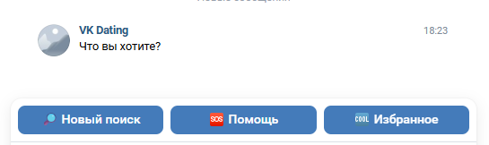
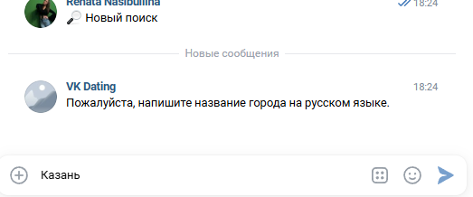
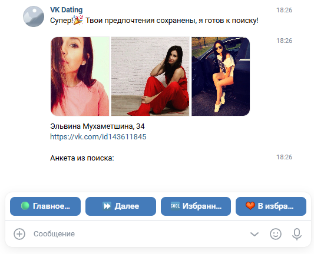
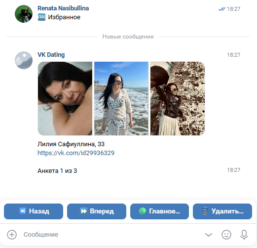

# VK Dating Bot

VK Dating Bot — модульный Python-бот для ВКонтакте, который помогает пользователям искать анкеты по критериям и сохранять понравившиеся профили в избранное.

## Возможности

- Поиск анкет по городу, полу и возрасту
- Автоматическая фильтрация закрытых профилей и профилей без фото
- Сохранение понравившихся анкет в избранное
- Навигация по избранным анкетам (вперёд/назад)
- Удаление анкет из избранного
- Автоматический выбор трёх лучших фотографий по количеству лайков
- Обработка ошибок API с автоматическими повторами

## Структура проекта

    .
    ├── main.py                  # Точка входа
    ├── config.py                # Загрузка и валидация конфигурации
    ├── bot/
    │   ├── bot_service.py       # Сервис отправки сообщений
    │   ├── core/                # Ядро бота
    │   │   ├── bot.py           # Запуск бота
    │   │   ├── handlers.py      # Обработчики событий
    │   │   └── states.py        # Состояния диалога
    │   ├── database/            # Работа с БД
    │   │   ├── models.py        # SQLAlchemy модели
    │   │   ├── session.py       # Управление сессиями
    │   │   ├── init_db.py       # Инициализация БД
    │   │   └── repositories/    # Репозитории (user, status, favorite)
    │   ├── vk_api/              # Работа с VK API
    │   │   ├── client.py        # Инициализация клиентов VK
    │   │   ├── decorators.py    # Декораторы повторных попыток
    │   │   ├── photos.py        # Получение фотографий
    │   │   ├── search.py        # Поиск анкет
    │   │   └── users.py         # Работа с пользователями и городами
    │   ├── ui/                  # Интерфейс
    │   │   ├── formatter.py     # Форматирование сообщений
    │   │   ├── keyboard.py      # Создание клавиатур
    │   │   └── messages.py      # Тексты сообщений
    │   └── user/                # Бизнес-логика
    │       ├── preferences.py   # Настройка предпочтений
    │       ├── favorites.py     # Управление избранным
    │       ├── search_flow.py   # Поток поиска
    │       └── service.py       # Общий сервис
    ├── tests/                   # Тесты (pytest, 205 тестов, 79% покрытия)
    └── docs/                    # Документация

## Команды бота

### Основные команды

| Кнопка | Описание |
|--------|----------|
| 🎬 Начать | Запуск процесса настройки предпочтений для поиска |
| 🆘 Помощь | Показать справочную информацию |
| 🆒 Избранное | Открыть список сохранённых анкет |
| 🟢 Главное меню | Вернуться в главное меню |
| 🔎 Новый поиск | Начать новый поиск с изменением критериев |

### Навигация по анкетам (режим поиска)

| Кнопка | Описание |
|--------|----------|
| ⏩ Далее | Перейти к следующей анкете |
| ❤ В избранное | Сохранить текущую анкету в избранное |

### Навигация по избранным анкетам

| Кнопка | Описание |
|--------|----------|
| 👀 Продолжить просмотр | Вернуться к просмотру избранного |
| 🪪 К просмотру кандидатов | Перейти к обычному поиску |
| ⏩ Вперед | Следующая анкета в избранном |
| ⏪ Назад | Предыдущая анкета в избранном |
| 🗑 Удалить из Избранного | Удалить текущую анкету из избранного |

### Кнопки выбора предпочтений

| Кнопка | Описание |
|--------|----------|
| ♂️ Муж. | Искать мужчин |
| ♀️ Жен. | Искать женщин |
| Не имеет значение | Искать всех |

## Настройка группы ВКонтакте

### 1. Создание сообщества

1. Перейдите на [vk.com/groups](https://vk.com/groups) и нажмите «Создать сообщество»
2. Выберите тип «Бот»
3. Укажите название и категорию сообщества
4. В настройках сообщества (**Управление сообществом → Работа с API**):
   - Создайте ключ доступа (**Создать ключ**)
   - Отметьте все необходимые права доступа
   - Скопируйте полученный токен — это `BOT_TOKEN`

### 2. Настройка Long Poll API

1. В разделе **Управление сообществом → Работа с API → Long Poll API**:
   - Включите Long Poll API
   - Выберите версию API (рекомендуется 5.131 или выше)
   - Установите тип событий: «Только сообщения»

2. В разделе **Управление сообществом → Сообщения**:
   - Включите сообщения сообщества
   - В настройках для бота включите «Возможности ботов»

### 3. Получение личного токена пользователя

Для поиска анкет через метод `users.search` нужен личный токен пользователя:

1. Перейдите по ссылке:
   ```
   https://oauth.vk.com/authorize?client_id=YOUR_APP_ID&scope=friends&redirect_uri=https://oauth.vk.com/blank.html&display=page&response_type=token&v=5.131
   ```
   Замените `YOUR_APP_ID` на ID вашего приложения из [vk.com/apps](https://vk.com/apps?act=manage)
2. Авторизуйтесь и подтвердите права доступа
3. В адресной строке появится токен после `access_token=`
4. Скопируйте его — это `MY_VK_TOKEN`

> ⚠️ **Важно:** Никогда не публикуйте токены в открытом доступе и не коммитьте файл `.env` в репозиторий.

### 4. Настройка базы данных

Бот использует PostgreSQL. Создайте базу данных и укажите строку подключения в `.env`:

    DATABASE={"user": "postgres", "password": "your_password", "host": "localhost", "port": "5432", "database": "dating_bot"}

## Быстрый запуск

1. Клонируйте репозиторий:
   ```bash
   git clone <your-repo-url>
   cd VK-Dating-Bot
   ```

2. Создайте виртуальное окружение и активируйте его:
   ```bash
   python -m venv .venv
   .venv\Scripts\activate
   ```

3. Установите зависимости:
   ```bash
   pip install -r requirements.txt
   ```

4. Скопируйте `.env.example` в `.env` и заполните значения:
   ```bash
   copy .env.example .env
   ```
   Отредактируйте `.env`, указав:
   - `BOT_TOKEN` — токен сообщества
   - `MY_VK_TOKEN` — личный токен пользователя
   - `DATABASE` — строка подключения к PostgreSQL

5. Инициализируйте базу данных (таблицы создадутся автоматически при первом запуске)

6. Запустите бота:
   ```bash
   python main.py
   ```

## Сценарий использования

1. Пользователь пишет боту любое сообщение
2. Бот отправляет приветствие и предлагает начать поиск
3. Пользователь нажимает «🎬 Начать»
4. Последовательно указывает: город, пол, возрастной диапазон
5. Бот показывает анкеты с тремя лучшими фотографиями
6. Пользователь может:
   - Нажать «⏩ Далее» для перехода к следующей анкете
   - Нажать «❤ В избранное» для сохранения анкеты
   - Нажать «🟢 Главное меню» для возврата
7. Через «🆒 Избранное» можно просматривать сохранённые анкеты и управлять ими

## Скриншоты интерфейса

### Приветствие и главное меню



### Выбор предпочтений



### Просмотр анкеты



### Избранное




## Тестирование

Проект покрыт 205 тестами с общим покрытием 79%.

Запуск всех тестов:
```bash
pytest tests/ -v
```

Запуск с отчётом о покрытии:
```bash
pytest tests/ --cov=bot --cov-report=term-missing
```

## Документация

Дополнительная документация находится в папке `docs/`:

- [docs/SETUP.md](docs/SETUP.md) — подробная инструкция по установке
- [docs/architecture.md](docs/architecture.md) — архитектурное описание проекта
- [docs/technical_specification.md](docs/technical_specification.md) — технические требования
- [docs/user_experience.md](docs/user_experience.md) — опыт пользователя и сценарии
- [docs/technical_experience.md](docs/technical_experience.md) — технический опыт разработки

## Требования

- Python 3.14+
- PostgreSQL
- VK API (сообщество + личный токен)

## Лицензия

MIT