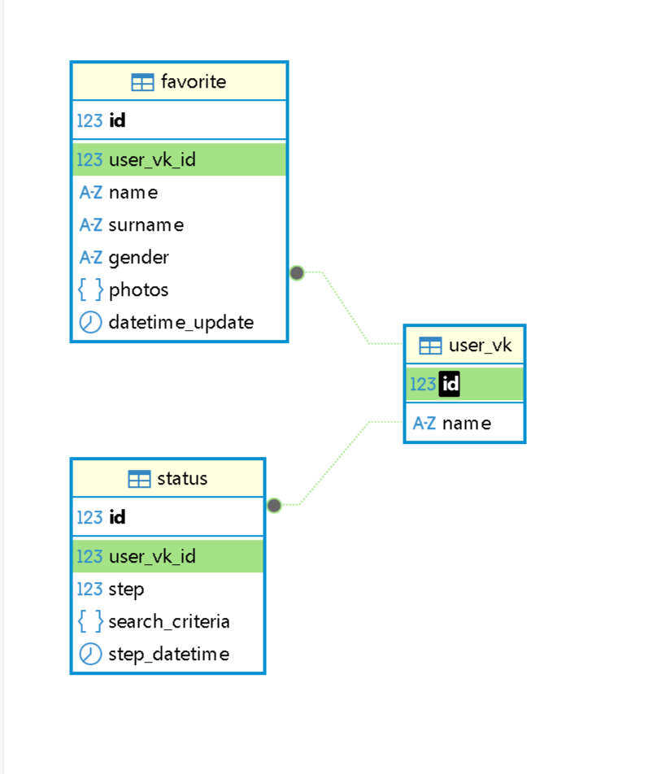

# Бот ВКонтакте "VK Dating Bot" - Документация

## 1. Описание программы
Бот в сообществе ВКонтакте, который помогает пользователям находить новых людей для общения.

#### 2. Системные требования
- Windows 10/11, macOS 12+, или Linux (Ubuntu 20.04+)
- Python 3.9+
- 20 МБ свободного дискового пространства

## 3. Установка
### 3.1. Требования

### 3.2. Настройка программы

## 4.Файлы проекта

## 5. Схема созданной базы данных

## 6. Запуск проекта

